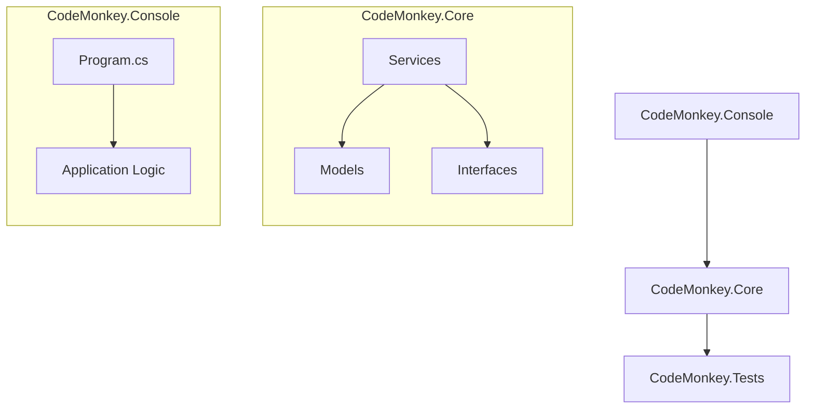

# Context Map

This document serves as the architectural "blueprint" for the CodeMonkey repository. It focuses on high-level system design and conceptual dependencies. 

**Note:** For specific file-level navigation and the current codebase map, please refer to the [INDEX.md](./INDEX.md).

## 🗺️ Architectural Overview

## 📂 Structural Hierarchy

### 1. CodeMonkey.Console
**Purpose:** The entry point and user interface of the system.
- **Primary Responsibility:** Handling input/output, orchestration of high-level tasks, and application bootstrapping.

### 2. CodeMonkey.Core
**Purpose:** The heart of the system, containing business logic and domain models.
- **Primary Responsibility:** Providing the core functionality and rules that govern the system.

### 3. CodeMonkey.Tests
**Purpose:** Ensuring stability and correctness.
- **Primary Responsibility:** Validating that the Core and Console projects behave as expected.

---
*Note: This map should be updated whenever a new project or major namespace is added to the solution.*
