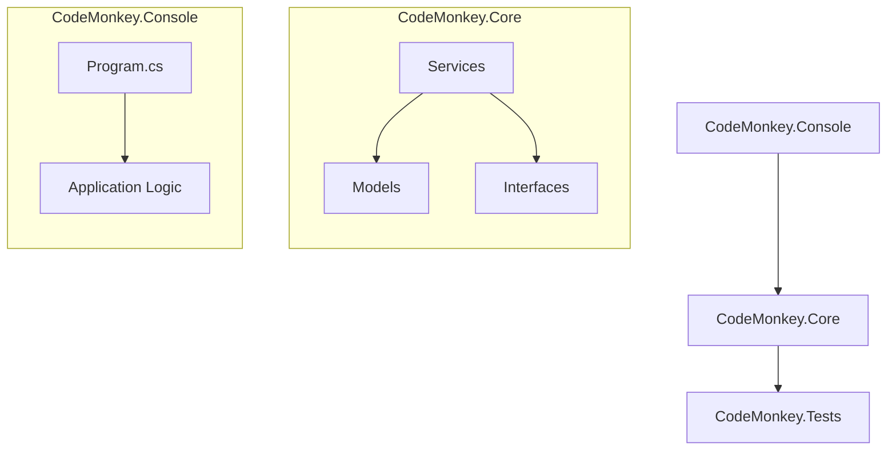

# Context Map

This document serves as the structural "source of truth" for the CodeMonkey repository. It is designed to allow both humans and AI agents to navigate the system by zooming from high-level projects down to specific components.

## 🗺️ Architectural Overview

## 📂 Structural Hierarchy

### 1. CodeMonkey.Console
**Purpose:** The entry point and user interface of the system.
- **Primary Responsibility:** Handling input/output, orchestration of high-level tasks, and application bootstrapping.
- **Key Components:**
    - `Program.cs`: The main entry point.
    - Application Logic: Orchestrates the flow between the user and the Core services.

### 2. CodeMonkey.Core
**Purpose:** The heart of the system, containing business logic and domain models.
- **Primary Responsibility:** Providing the core functionality and rules that govern the system.
- **Key Components:**
    - `Models`: Domain objects and data structures.
    - `Services`: Business logic implementations (including Surgical File System Services for range-based operations).
    - `Interfaces`: Contracts that decouple the system and allow for easier testing.

### 3. CodeMonkey.Tests
**Purpose:** Ensuring stability and correctness.
- **Primary Responsibility:** Validating that the Core and Console projects behave as expected.
- **Key Components:**
    - Unit Tests: Testing individual components in isolation.
    - Integration Tests: Testing the interaction between multiple components.

## 🔍 Central File Index

| File/Directory | Purpose | Importance |
| :--- | :--- | :--- |
| `AGENTS.md` | Instructions for AI Agents | Critical |
| `README.md` | Project entry point and vision | High |
| `CONTEXT-MAP.md` | Structural map of the repo | Critical |
| `docs/` | Deep-dive documentation | High |
| `CodeMonkey.Core/` | Core business logic | Critical |
| `CodeMonkey.Console/` | System entry point | High |
| `CodeMonkey.Tests/` | Quality assurance | High |

---
*Note: This map should be updated whenever a new project or major namespace is added to the solution.*
